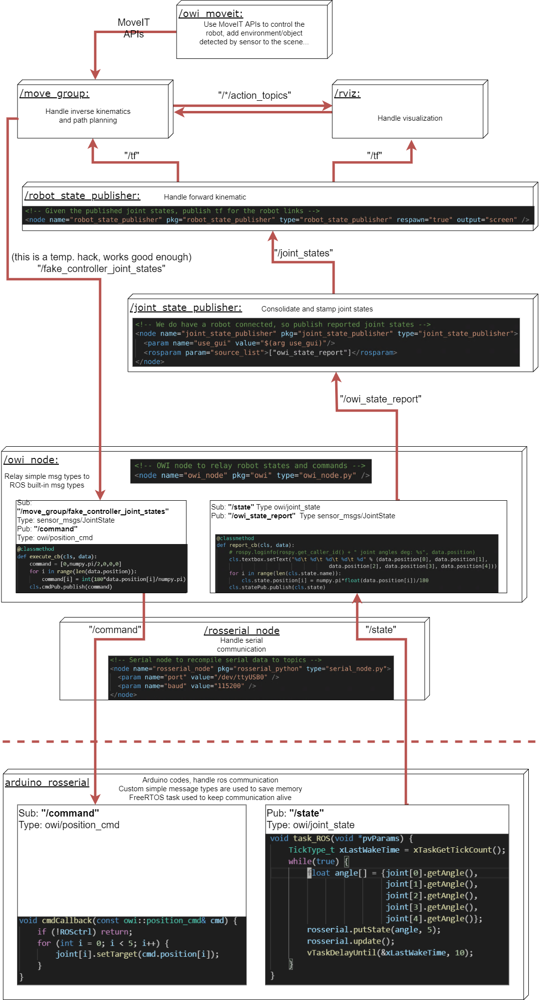

Description
============

This project intend to use the power of ROS and Arduino to bring life to the low cost 4dof OWI Robotic Arm Edge: 

https://www.amazon.com/OWI-Robotic-Soldering-Required-Extensive/dp/B0017OFRCY

This repo is the ROS side of the project. The Arduino side can be checked out at:

https://github.com/ngpbach/owi-arduino

See it in action:
https://youtu.be/lFCY_yz-M0M

Status
============

Project is already at a basic functionality stage. Arduino code handle initial tests, PID control and limit checking. Once passing the control to ROS, RVIZ is used for visualization and MOVEIT APIs used for path planning/inverse kinematic. A simple GUI panel is also provided with sensors report and joint position control sliders.

One shortcoming of MOVEIT builtin ik_solver was that it was built for 6dof manipulators, so for it to work with this arm I had to hack a fake joint at the end effector, or use "position only" mode (either way, it would not care about rotation of the real end effector). A lightweight solution is to write a close form ik solver for the wrist joint,and let MOVEIT position ik handle the parent.

Next step is integrating with a Kinect camera to detect human face position and do some something fancy.

Build and run instructions will come.

Flow
============

This is for a basic visualization of how I implemented the data flow from Arduino to ROS.

